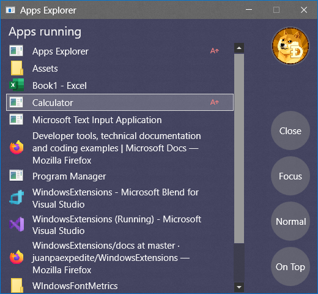
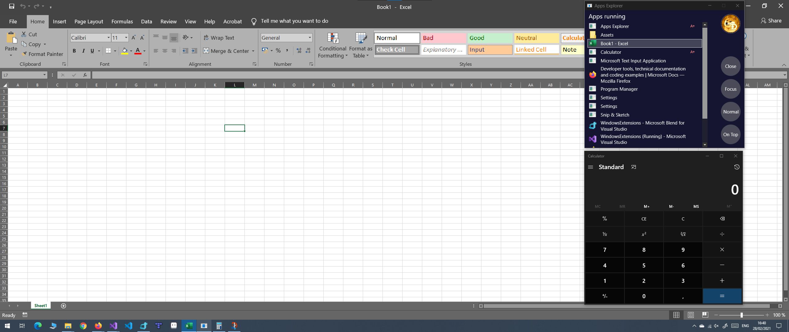

# Apps running explorer
This app is a great improvement for productivity.

- Have a main window like Excel or Word and the calculator and any other on top.
- Select the exact window like Browsers with the name on it and focus or close.
- Close the store apps that are sleeping.

An example of a main window with Calculator and Apps running explorer on top.

Click on releases to download (upper right area), unzip and run.

